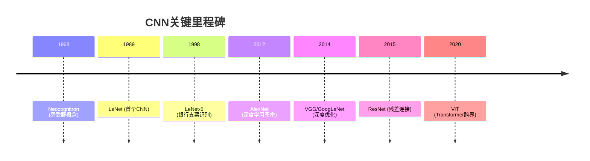
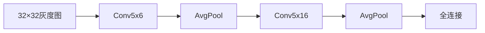
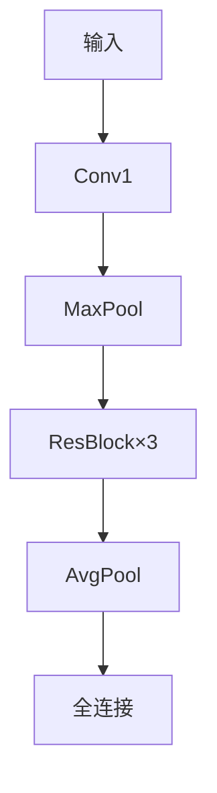

# 卷积神经网络(CNN)发展简史

## 📜 发展脉络


## 🏆 核心架构演进

### 1. 古典时期（1989-2011）
| 网络      | 贡献                          | 特点                     |
|-----------|-------------------------------|--------------------------|
| Neocognitron | 局部感受野概念              | 模拟生物视觉机制         |
| LeNet-5   | 首个实用CNN架构               | 卷积+池化交替结构        |

### 2. 深度学习革命（2012-2015）
```diff
+ AlexNet (2012)
  - ReLU激活函数
  - Dropout正则化
  - 多GPU训练
! ImageNet错误率从26%→15.3%

+ VGGNet (2014)
  - 19层统一3×3卷积
  - 证明深度重要性

+ GoogLeNet (2014)
  - Inception模块
  - 参数量减少12倍
```

### 3. 结构优化时代（2015-2017）
```python
# ResNet (2015)
class ResidualBlock(nn.Module):
    def __init__(self):
        self.conv = nn.Conv2d(...)
        
    def forward(self, x):
        return x + self.conv(x)  # 残差连接
```
- **突破**：训练152层网络（ImageNet错误率3.57%）

### 4. 现代架构（2018-至今）
| 类型       | 代表网络         | 创新点                     |
|------------|------------------|----------------------------|
| 轻量化     | MobileNet        | 深度可分离卷积             |
| 自动化设计 | EfficientNet     | 复合缩放策略               |
| 混合架构   | ConvNeXt         | CNN+Transformer融合        |

## 📊 性能进化曲线
```vega-lite
{
  "data": {"values": [
    {"year": 2010, "error": 26},
    {"year": 2012, "error": 15.3},
    {"year": 2015, "error": 3.57},
    {"year": 2020, "error": 2.5}
  ]},
  "mark": "line",
  "encoding": {
    "x": {"field": "year", "type": "ordinal"},
    "y": {"field": "error", "scale": {"reverse": true}}
  }
}
```

## 🔮 未来方向
- 神经架构搜索(NAS)
- 脉冲神经网络(SNN)
- 量子卷积网络(QCNN)

> 注：本Markdown需支持mermaid/vega-lite渲染（如VS Code+Markdown Preview Enhanced插件）

# CNN手写实现路线图

## 🧠 学习目标
**掌握从经典到现代的CNN实现范式，理解架构演进背后的设计哲学**

## 📚 基础篇（2周）
### 1. LeNet-5

- **关键训练**：手动计算各层特征图尺寸
- **数据集**：MNIST

### 2. AlexNet
```diff
+ 新增实现：
  - ReLU激活层
  - 重叠最大池化
  - 局部响应归一化(LRN)
```
- **注意**：原始论文的双GPU分支可简化为单路

### 3. VGGNet
```python
# 典型结构示例
cfg = {
    'VGG11': [64, 'M', 128, 'M', 256, 256, 'M', 512, 512, 'M', 512, 512, 'M'],
    'VGG16': [64, 64, 'M', 128, 128, 'M', 256, 256, 256, 'M', 512, 512, 512, 'M', 512, 512, 512, 'M']
}
```

## 🚀 进阶篇（2周）
### 4. ResNet

- **核心挑战**：残差连接的反向传播实现
- **扩展**：尝试不同block数量(18/34/50层)

### 5. Inception v3
```text
分支结构实现顺序：
1. 1×1卷积降维
2. 并行3×3/5×5卷积
3. 特征拼接(concat)
```

### 6. MobileNetV2
```python
class InvertedResidual(nn.Module):
    def __init__(self, inp, oup, stride):
        super().__init__()
        self.stride = stride
        assert stride in [1, 2]

        hidden_dim = int(inp * 6)  # 扩展因子
        self.use_res_connect = stride == 1 and inp == oup
        ...
```

## 🔮 大师篇（2周）
### 7. EfficientNet
```vega-lite
{
  "mark": "bar",
  "encoding": {
    "x": {"field": "compound_coef", "type": "ordinal"},
    "y": {"field": "accuracy", "scale": {"domain": [70, 85]}}
  "data": {
    "values": [
      {"compound_coef": "B0", "accuracy": 76.3},
      {"compound_coef": "B4", "accuracy": 82.9}
    ]
  }
}
```
- **关键**：复合缩放(φ系数)实现

### 8. ConvNeXt
```text
实现步骤：
1. 将ResNet的Bottleneck替换为DWConv
2. 添加LayerScale模块
3. 引入倒置瓶颈设计
```

## 📌 实践建议
1. **代码规范**：
   - 使用PyTorch框架
   - 每个网络独立为.py文件
   - 必须包含forward可视化

2. **测试标准**：
   ```text
   | 网络       | 测试数据集 | 目标准确率 |
   |------------|------------|------------|
   | LeNet-5    | MNIST      | >99%       |
   | ResNet-18  | CIFAR-10   | >93%       |
   ```

3. **调试技巧**：
   - 使用torchsummary打印各层维度
   - 梯度检查：`torch.autograd.gradcheck`
   - 可视化工具：TensorBoard

[//]: # (注释：此Markdown需配合mermaid/vega-lite插件查看完整效果)